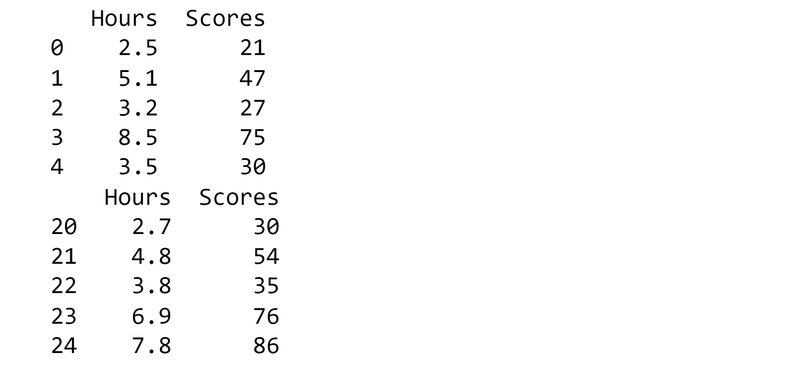
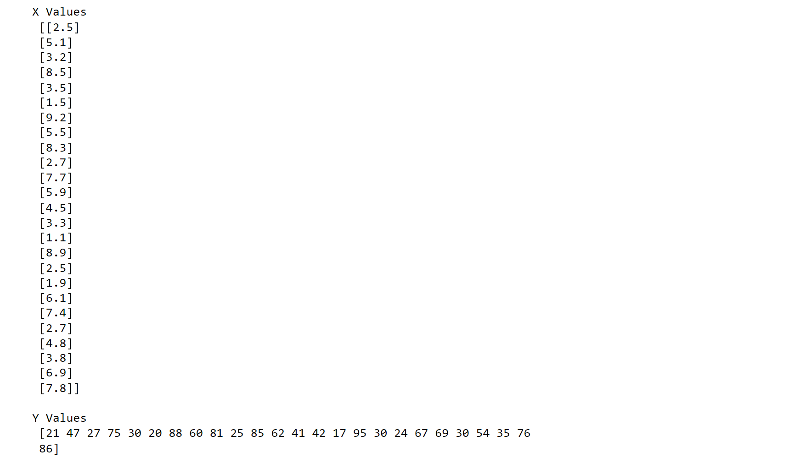
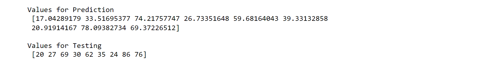
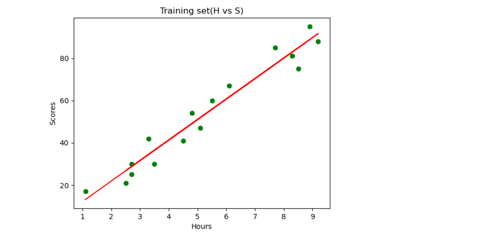
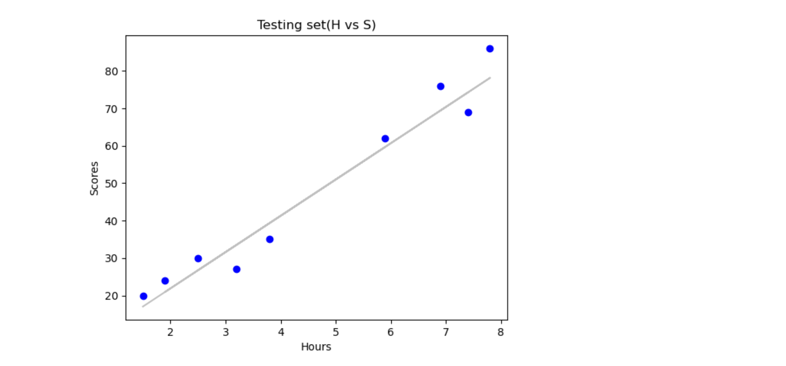
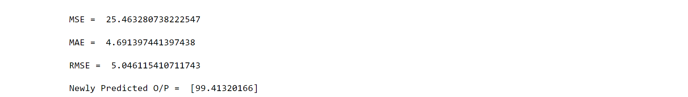

# Implementation-of-Simple-Linear-Regression-Model-for-Predicting-the-Marks-Scored

## AIM:
To write a program to predict the marks scored by a student using the simple linear regression model.

## Equipments Required:
1. Hardware – PCs
2. Anaconda – Python 3.7 Installation / Jupyter notebook

## Algorithm
1. Import the required libraries and read the dataframe.
2. Assign hours to X and scores to Y.
3. Implement training set and test set of the dataframe
4. Plot the required graph both for test data and training data.

## Program:
```
/*
Program to implement the simple linear regression model for predicting the marks scored.
Developed by: MOHAMED ROSHAN S
RegisterNumber:  212222040101
*/
```
```py

#import libraries
import numpy as np
import pandas as pd
from sklearn.metrics import mean_absolute_error,mean_squared_error
import matplotlib.pyplot as plt
#reading data sets from excel sheets
dataset=pd.read_csv('student_scores.csv')
print(dataset.head())
print(dataset.tail())
#assigning hours to x and scores to y
X = dataset.iloc[:,:1].values
print("\nX Values\n",X)
Y = dataset.iloc[:,-1].values
print("\nY Values\n",Y)
#train the model
from sklearn.model_selection import train_test_split
X_train,X_test,Y_train,Y_test = train_test_split(X,Y,test_size=1/3,random_state=0)
from sklearn.linear_model import LinearRegression
reg = LinearRegression()
reg.fit(X_train,Y_train)
Y_pred = reg.predict(X_test)
print("\nValues for Prediction\n",Y_pred)
print("\nValues for Testing\n",Y_test)
#plot the 2-D graph from matplotlib (training)
plt.scatter(X_train,Y_train,color="green")
plt.plot(X_train,reg.predict(X_train),color="red")
plt.title('Training set(H vs S)')
plt.xlabel("Hours")
plt.ylabel("Scores")
plt.show()
#plot the 2-D graph from matplotlib (testing)
plt.scatter(X_test,Y_test,color="blue")
plt.plot(X_test,reg.predict(X_test),color="silver")
plt.title('Testing set(H vs S)')
plt.xlabel("Hours")
plt.ylabel("Scores")
plt.show()
#finding errors in model
mse=mean_squared_error(Y_test,Y_pred)
print('MSE = ',mse)
mae=mean_absolute_error(Y_test,Y_pred)
print('\nMAE = ',mae)
rmse=np.sqrt(mse)
print('\nRMSE = ',rmse)
#For unknown value which is not in data 
a=np.array([[10]])
Y_pred1=reg.predict(a)
print("\nNewly Predicted O/P = ",Y_pred1)

```

## Output:








## Result:
Thus the program to implement the simple linear regression model for predicting the marks scored is written and verified using python programming.
